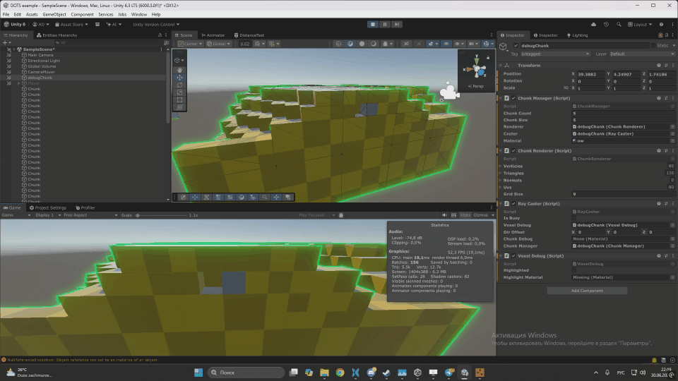

# Greedy meshing demo 

This project demonstrates a greedy meshing algorithm for voxel terrain.
The algorithm searches for the largest possible rectangular area and rebuilds it using the minimum number of quads.
Raycasting is implemented using the 3D Digital Differential Analyzer (DDA) algorithm, which traverses the voxel grid one voxel at a time until a non-empty voxel is found.

